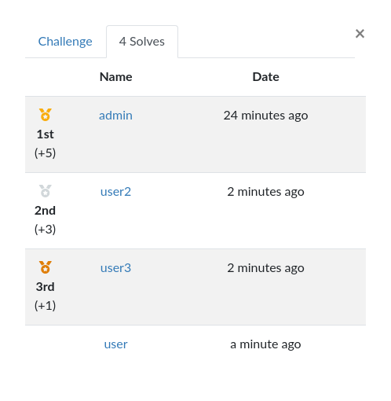
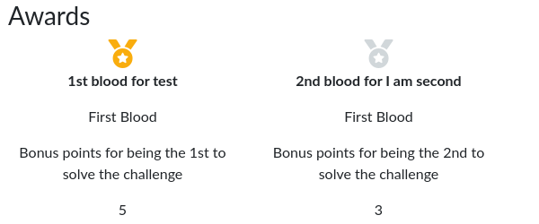

# CTFd First Blood
A small CTFd plugin to give First Blood points.

This plugin adds a new challenge type that grants additional points to first N people who solve it.

## Installation

Clone this repo to `CTFd/plugins/CTFd_first_blood` in your CTFd installation directory and restart it. You should see the first blood challenge type in new challenge screen.

Tested with CTFd 3.1.1 and 3.2.0.
